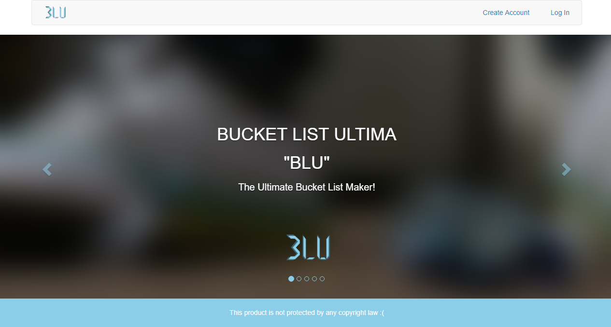
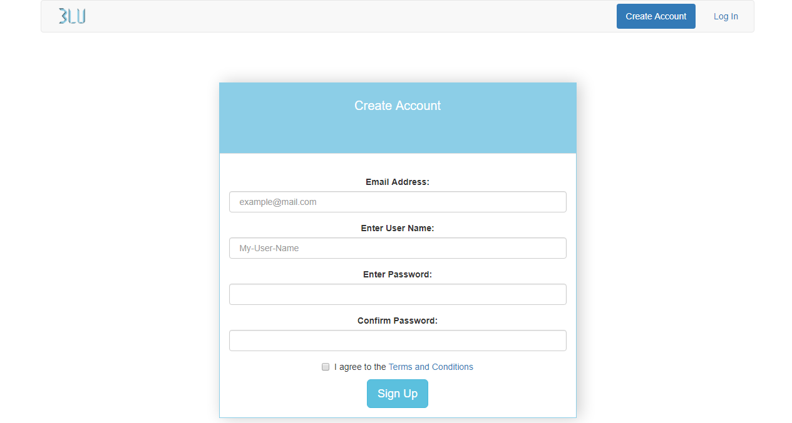
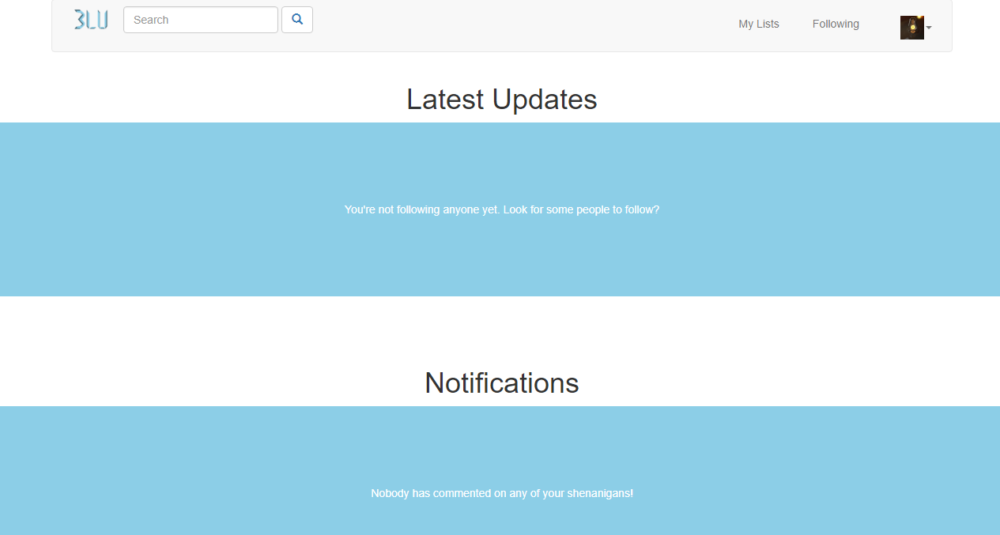
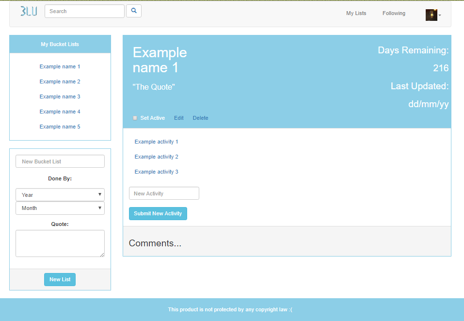
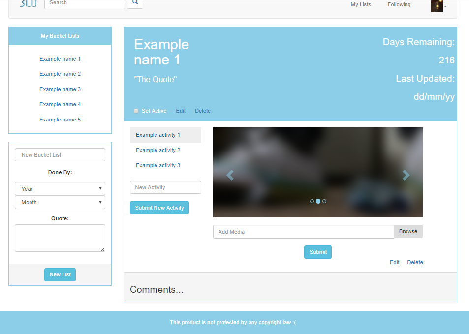

# Bucket-List-Ultima

An application to plan, record and share achievements/experiences.

### Current UI 17/7/2017:
1. Landing page with introductory text and image carousel
    1.1 Forms to add an account and log in to an existing account
2. Home page
3. Bucket list page (responsive) with sections to view and modify bucket lists and activities
4. Following page

## Features of the release version(updated):
1. Users can create a personal account and log in from the internet
2. Users with accounts can create bucketlists, add activities to each bucketlist and edit details for both
3. Users can update the login details for their account and delete their account from the records

### The file "index.html" contains the landing page of the UI layout. It has the following features:
1. Introductory title and picture slideshow
2. A navigation bar to:
    2.1 Reload the page
    2.2 Access #3
    2.3 Access #4
3. A form to accept input and create a new user account
4. A form to accept input and log in to an existing user account

### The file "home.html" contains the main interactive page with the following features:
1. A navigation bar to:
    2.1 Reload the page
    2.2 Access #2
    2.3 Access #3
    2.5 Access #4
2. A link to the user's bucketlists page (default active page) "MyLists.html"
3. A link to the user's Settings page where the user can edit their login details and delete their account.
4. A link to log out, end the user's session and return to the Landing Page.

### The file "MyLists.html" has the following features:
1. View all the user's bucketlists
2. Create a new bucketlist
3. View a specific bucketlist's information
4. View items (activities) inside a bucketlist
5. Delete a bucketlist
6. Update a bucketlist's information
7. Create a new activity in a bucketlist
8. Delete an activity from a bucketlist

## Instructions for Use (APP):
1. Navigate the carousel to view all the images and captions by clicking on the left and right chevrons
2. Open the Create Account tab by clicking on the button on the navigation bar labeled "Create Account"
3. Enter input to the fields as you wish and submit the input by clicking on the button labeled "Sign Up".
(You will be redirected to the Log In tab)
4. Open the Log In tab by clicking on the button labeled "Log In"
5. Click on the icon to the left on the navigation bar to reload the landing page
6. Enter input to the fields of the Log In tab as you wish and submit it by clicking on the button labeled "Log In"
8. Click on the icon to the left on the navigation bar to reload the home page
9. To the left on the "My Bucket Lists" page are two panels for managing bucket lists. 
    The top panel has a list of all the user's bucketlists.
    The bottom panel has a form to create a new bucketlist. The input fields available are:
    1. A name - text, the name of the list
    2. A year - date, the year by which the activities on the list must be completed
    3. A month - date, the month by which the activities on the list must be completed
    4. A quote - text, a description of the list or a memorable message related to the list
    The button labeled "Submit New List" will be used to create a new bucketlist with the values in the form. All values must be present to create a new bucketlist.
11. To the right of the "MyLists" page is a panel that contains the information and items for a selected bucket list. 
    Select a bucket list by clicking on its name on the left top panel to view its content.
    On the panel header are two buttons, one to update the bucketlist information and the other to delete the bucketlist.
    Also included in the header is:
    1. The name of the bucketlist
    2. The bucketlist's quote
    3. The number of days remaining to complete the list
12. Select an activity on a bucketlist by clicking on the name of the activity in the panel body.
    Edit or delete the activity respectively by clicking on the "Edit" or "Delete" buttons below the "Submit" button
13. Navigate to the "Settings" page by clicking on the button in the navigation bar labeled "Settings"
14. The user's account username and email address are displayed in the "Settings" page.
    To change the account username, email address or password, enter the information in the fields and click on the button labeled "Submit".
    To delete the user account, click on the button labeled "Delete User Account"
14. Return to the landing page by clicking on the button labeled "Log Out" on the navigation bar while in any page.
