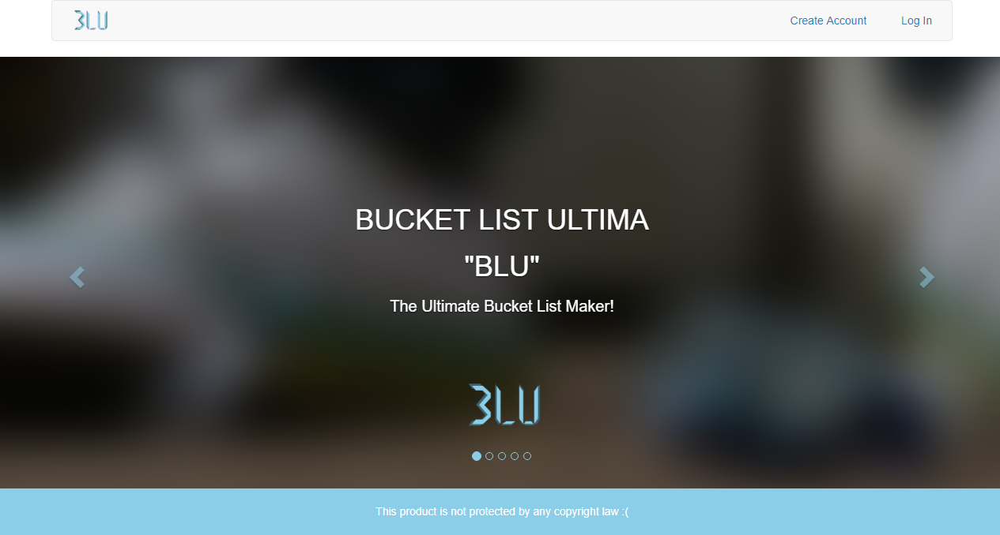

# Bucket-List-Ultima
An application to plan, record and share achievements/experiences

###Current UI 16/7/2017:
1. Landing page with introductory text and image carousel
    1.1 Forms to add an account and log in to an existing account
2. Home page
3. Bucket list page (responsive) with sections to view and modify bucket lists and activities
4. Following page

##Features of the release version:
1. Users can create a personal account and log in from the internet
2. Users can access an offline version of their account
3. Users with accounts can create bucket-lists, add activities to them and manipulate both
4. Users with accounts can attach media files to each activity
5. Users can view bucket lists with status 'active' and their media files
6. Users with accounts can comment on activities of bucket lists with status 'active'

###The file "index.html" contains the landing page of the UI layout. It has the following features:
1. Introductory title and picture slideshow
2. A navigation bar to:
    2.1 Reload the page
    2.2 Access #3
    2.3 Access #4
3. A form to accept input and create a new user account
4. A form to accept input and log in to an existing user account
5. A placeholder document for legal purposes

###The file "user/home.html" contains the main interactive page with the following features:
1. A landing with update notifications about followed bucket lists and new comments to user's bucket lists
2. A navigation bar to:
    2.1 Reload the page
    2.2 Access #3
    2.3 Access #4
    2.4 Do a search
    2.5 Access #5
3. A link to "MyLists.html"
4. A link to "Following.html" 
5. A tab where the user can:
    5.1 View account profile
        5.1.1 Change account username
        5.1.2 Change account password
        5.1.3 Change account picture
    

###The file "MyLists.html" has the following features:
1. View all bucket lists
2. Add a bucket list
3. Remove a bucket list
4. Change bucket list status between active and inactive
5. View the number of user accounts following a bucket list
6. View all activities inside a bucket list
7. Add an activity inside a bucket list
8. Remove an activity from a bucket list
9. View all media files inside an activity
10. Add a media file inside an activity
11. Remove a media file from an activity
12. View comment history inside an activity
13. Make comments inside an activity

###The file "Following.html" has the following features:
1. Browse other user accounts' "active" bucket lists, their activities and their media files
2. Activate "follow" on other user accounts' "active" bucket lists
3. View "followed" bucket lists
4. "Unfollow" bucket lists
5. Comment on other user accounts' "active" bucket list

##Instructions for Use (DEMO UI):
1. Navigate the carousel to view all the images and captions by clicking on the left and right chevrons
2. Open the "Create Account" tab by clicking on the button on the navigation bar labeled "Create Account"
3. Enter input to the fields as you wish and navigate to the "verification" page by clicking on the button labeled "Sign Up"
4. Open the "Log In" tab by clicking on the button labeled "Log In"
5. The "Log In" and "Sign Up" tabs also work in the "verification" page
6. Click on the icon to the left on the navigation bar to reload the landing page
7. Enter input to the fields as you wish and navigate to the "home" page by clicking on the button labeled "Log In"
8. Click on the icon to the left on the navigation bar to reload the home page
9. Navigate to "MyLists" page by clicking on the button in the navigation bar labeled "My Lists"
10. To the left of the "MyLists" page are two panels for managing bucket lists. 
    The top panel has the complete number of bucket lists.
    The bottom panel has a form to create a new bucket list. The input fields available are:
    1. A name - text, the name of the list
    2. A year - date, the year by which the activities on the list must be completed
    3. A month - date, the month by which the activities on the list must be completed
    4. A quote - text, a memorable message related to the list
    The button labeled "New List" will be used to create a new bucket list with the values in the form
11. To the right of the "MyLists" page is a panel that contains the activities and options for a selected bucket list. 
    Select a bucket list by clicking on the name on the left top panel to toggle its respective activities.
    On the panel header are two options, a checkbox to make the list "active" and thus visible to other users and a button to delete the entire list.
    Also included in the header is a countdown timer showing days remaining for the activities to be completed
12. Select an activity on a bucket list by clicking on the name of the activity.
    Selecting an activity will toggle its media and make them visibile.
    Browse media by clicking on the left and right chevrons of the carousel.
    Add new media to the carousel by entering a file path on the input field below it or clicking on the "browse" button to browse files on disk. Then click on the button labeled "Submit" to submit the media
    Edit and delete the activity respectively by clicking on the "Edit" and "Delete" buttons below the "Submit" button
13. Navigate to the "Following" page by clicking on the button in the navigation bar labeled "Following"
14. Return to the landing page by clicking on the icon dropdown menu to the far right of the navigation bar and clicking on "Log Out"
